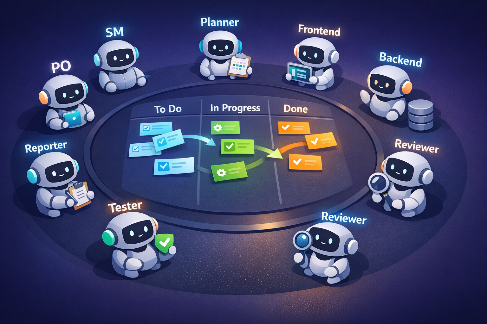

# Claude Code AI Sprint Team



Claude Code のエージェント・スキル・Hook を組み合わせた、スクラム開発を自律的に回す AI 開発チームのテンプレートです。

GitHub Issues にバックログを登録し、スラッシュコマンドを実行するだけで、計画・実装・レビュー・テスト・PR 作成・振り返りまでを AI エージェントチームが自動で進めます。

**詳しい使い方は [docs/guide.md](docs/guide.md) を参照してください。**

---

## 何ができるか

| やりたいこと | コマンド | 何が起きるか |
|------------|---------|-------------|
| スプリントプランニング | `/sprint-plan 1 "認証機能"` | バックログ整理 → タスク分解 → Issue 更新 → マイルストーン作成 |
| Issue を実装する | `/implement 42` | 設計 → ブランチ作成 → 実装 → レビュー → テスト → PR 作成 |
| デイリースクラム | `/standup` | GitHub Issues から進捗取得 → Done/Today/Blockers を整理 |
| PR をレビューする | `/review-pr 15` | diff 分析 → セキュリティ・品質チェック → GitHub にコメント投稿 |
| スプリントレビュー | `/sprint-review` | 完了率集計 → レポート生成 → 未完了 Issue を次スプリントに移動 |
| スプリントレトロスペクティブ | `/retro` | KPT 整理 → CLAUDE.md にルール追記 → git commit |
| 日次レポートを出す | `/daily-report` | コミット・PR・Issue 集計 → Slack 通知 |

---

## クイックスタート

### 前提条件

- [Claude Code](https://docs.anthropic.com/en/docs/claude-code) がインストール済み
- [GitHub CLI (`gh`)](https://cli.github.com/) がインストール・認証済み
- Git リポジトリが初期化済み
- Node.js と pnpm（プロジェクトで使う場合）

### 導入手順

```bash
# 1. テンプレートをクローンまたはコピー
git clone https://github.com/your-org/sprint-team.git
cd sprint-team

# 2. 自分のプロジェクトに .claude/ を配置
#    既存プロジェクトに導入する場合:
cp -r .claude/ /path/to/your-project/.claude/
cp CLAUDE.md /path/to/your-project/CLAUDE.md

# 3. ドメイン知識を自分のプロジェクトに合わせて編集
#    .claude/rules/domain/ 配下のファイルを書き換える

# 4. GitHub CLI の認証を確認
gh auth status

# 5. Claude Code を起動
claude
```

### 最初のスプリントを回す

```bash
# Claude Code を起動した後:

# (1) バックログとなる Issue を作成
#     GitHub の Web UI または gh CLI で Issue を作成し、ready ラベルを付ける

# (2) スプリントプランニングを実行
/sprint-plan 1 "最初のスプリントゴール"

# (3) Issue の実装を開始
/implement 1

# (4) スプリント終了時
/sprint-review
/retro
```

---

## 仕組みの概要

### エージェント（8名のチームメンバー）

各エージェントは `.claude/agents/` に定義されており、スキル実行時に自動で起動されます。

| エージェント | 役割 | 起動タイミング |
|------------|------|--------------|
| **product-owner** | バックログ管理・優先順位付け・受け入れ基準定義 | `/sprint-plan` 内 |
| **planner** | 要件分析・タスク分解・実装設計 | `/implement` の最初に必ず |
| **backend-dev** | DB・API の実装 | planner の計画に DB/API タスクがある場合 |
| **frontend-dev** | UI の実装 | planner の計画に UI タスクがある場合 |
| **reviewer** | コードレビュー・セキュリティ監査 | 実装完了後、PR 作成前に必ず |
| **tester** | テスト設計・実装・実行 | reviewer の後 |
| **scrum-master** | 進行管理・障害除去・Slack 通知 | スプリントイベント時 |
| **reporter** | ドキュメント・レポート生成 | `/sprint-review`, `/daily-report` 時 |

### バックログ管理（GitHub Issues ベース）

GitHub Issues を唯一の正（Source of Truth）として、3層でバックログを管理します。

```
プロダクトバックログ（GitHub Issues, ラベル: backlog → ready）
  └─ スプリントバックログ（マイルストーン: Sprint N）
       └─ タスク（Issue body 内の - [ ] チェックリスト）
```

**ラベル:**

| ラベル | 意味 |
|--------|------|
| `backlog` | 未トリアージの Issue |
| `ready` | リファインメント済み。スプリントに投入可能 |
| `bug` | バグ報告 |
| `enhancement` | 機能追加・改善 |

**マイルストーン:**

- `Sprint N`（例: `Sprint 1`）をスプリントバックログに対応付ける
- `/sprint-plan` が自動で作成・設定する
- 未完了 Issue は `/sprint-review` で次スプリントに自動移動

**タスクリスト:**

planner エージェントが各 Issue の body に以下の形式でタスクを書き込みます:

```markdown
## タスク
- [ ] DB: bookings テーブルにカラム追加（backend-dev, 2pt）
- [ ] API: POST /api/bookings エンドポイント作成（backend-dev, 3pt）
- [ ] UI: BookingForm コンポーネント作成（frontend-dev, 5pt）
- [ ] Test: 予約フローのユニットテスト（tester, 2pt）
```

**sprint-state.md:**

`.claude/sprint-state.md` は GitHub Issues から生成される読み取り専用のスナップショットです。手動編集は不要です。`/sprint-plan` 実行時に自動生成されます。

### Hook（自動で動くガードレール）

Hook は Claude Code がツールを使うたびに自動実行されるシェルスクリプトです。`.claude/hooks/` に配置されています。

| Hook | いつ動くか | 何をするか |
|------|----------|-----------|
| **block-dangerous.sh** | Bash コマンド実行前 | `rm -rf`, `git push --force`, `.env` 読み取り, `sudo` などの危険な操作をブロック |
| **auto-quality.sh** | ファイル編集後 | ESLint 自動修正・Prettier フォーマットを実行（node_modules がある場合のみ） |
| **update-progress.sh** | Bash コマンド実行後 | Issue close や PR merge を sprint-log.md に記録 |
| **on-start.sh** | セッション開始時 | デイリースクラム用のコンテキスト（昨日のコミット、PR 状況）を収集 |
| **on-stop.sh** | セッション終了時 | sprint-state.md のタイムスタンプ更新、Slack 通知（設定時） |

### 自律進化（/retro）

`/retro` を実行するとスプリントレトロスペクティブが始まり、振り返りで得た学びが `CLAUDE.md` のルールに自動追記されます。次のスプリントから AI チームがそのルールに従うようになるため、スプリントを重ねるほどチームの動きが改善されます。

---

## カスタマイズ

### ドメイン知識の設定

`.claude/rules/domain/` 配下にプロジェクト固有の情報を記述してください:

- ビジネスモデル・ドメイン用語
- DB スキーマの主要テーブル
- 外部サービス連携（Stripe, SendGrid 等）
- 料金計算ルール等のビジネスロジック

### コーディング規約の変更

`.claude/rules/` 配下のファイルを編集してください:

| ファイル | 内容 |
|---------|------|
| `architecture.md` | ディレクトリ構成・依存関係ルール |
| `code-style.md` | コーディング規約・命名規則 |
| `testing.md` | テスト戦略・カバレッジ目標 |
| `security.md` | セキュリティルール・チェックリスト |

### エージェントの調整

`.claude/agents/[name]/AGENT.md` を編集すると、各エージェントの振る舞いを変更できます。

- レビュー観点を追加したい → `reviewer/AGENT.md` のチェックリストに追記
- テスト戦略を変えたい → `tester/AGENT.md` を編集
- タスク分解の粒度を変えたい → `planner/AGENT.md` の出力フォーマットを調整

### Slack 通知の設定

環境変数 `SLACK_WEBHOOK_URL` を設定すると、デイリースクラムやスプリント完了時に Slack 通知が送信されます。

```bash
export SLACK_WEBHOOK_URL=https://hooks.slack.com/services/T.../B.../xxx
```

未設定の場合、通知はスキップされ、ログのみ記録されます。

### ビルドコマンドの変更

`CLAUDE.md` の「ビルド・テストコマンド」セクションを自分のプロジェクトに合わせて編集してください。デフォルトは pnpm を前提としています。

---

## ファイル構成

```
your-project/
├── CLAUDE.md                         # 組織憲法（ルール・エージェント起動順序）
└── .claude/
    ├── sprint-state.md               # スプリント状態のスナップショット（自動生成）
    ├── sprint-log.md                 # エージェント活動ログ（自動追記）
    ├── settings.json                 # 権限設定・Hook 定義
    ├── agents/                       # エージェント定義（8名）
    │   ├── planner/AGENT.md
    │   ├── product-owner/AGENT.md
    │   ├── scrum-master/AGENT.md
    │   ├── frontend-dev/AGENT.md
    │   ├── backend-dev/AGENT.md
    │   ├── reviewer/AGENT.md
    │   ├── tester/AGENT.md
    │   └── reporter/AGENT.md
    ├── skills/                       # スラッシュコマンド（7つ）
    │   ├── sprint-plan/SKILL.md
    │   ├── implement/SKILL.md
    │   ├── standup/SKILL.md
    │   ├── review-pr/SKILL.md
    │   ├── sprint-review/SKILL.md
    │   ├── retro/SKILL.md
    │   └── daily-report/SKILL.md
    ├── hooks/                        # 自動実行スクリプト
    │   ├── pre-tool/block-dangerous.sh
    │   ├── post-tool/auto-quality.sh
    │   ├── post-tool/update-progress.sh
    │   ├── session/on-start.sh
    │   ├── session/on-stop.sh
    │   └── subagent/on-stop.sh
    └── rules/                        # プロジェクトルール
        ├── architecture.md
        ├── code-style.md
        ├── testing.md
        ├── security.md
        └── domain/                   # ドメイン知識（要カスタマイズ）
```

---

## トラブルシューティング

### `gh auth status` でエラーが出る

GitHub CLI が未認証です。以下を実行してください:

```bash
gh auth login
```

### Hook が動かない

`.claude/hooks/` 配下のスクリプトに実行権限があるか確認してください:

```bash
chmod +x .claude/hooks/**/*.sh
```

### スキルが見つからない

Claude Code のセッション内で `/` を入力するとスキル一覧が表示されます。表示されない場合は `.claude/skills/` ディレクトリが正しく配置されているか確認してください。

### sprint-state.md が古い

sprint-state.md はスナップショットです。最新の状態は GitHub Issues を参照してください。再生成するには `/sprint-plan` を実行するか、scrum-master エージェントに依頼してください。

### Slack 通知が届かない

環境変数 `SLACK_WEBHOOK_URL` が設定されているか確認してください:

```bash
echo $SLACK_WEBHOOK_URL
```

---

## ライセンス

MIT
